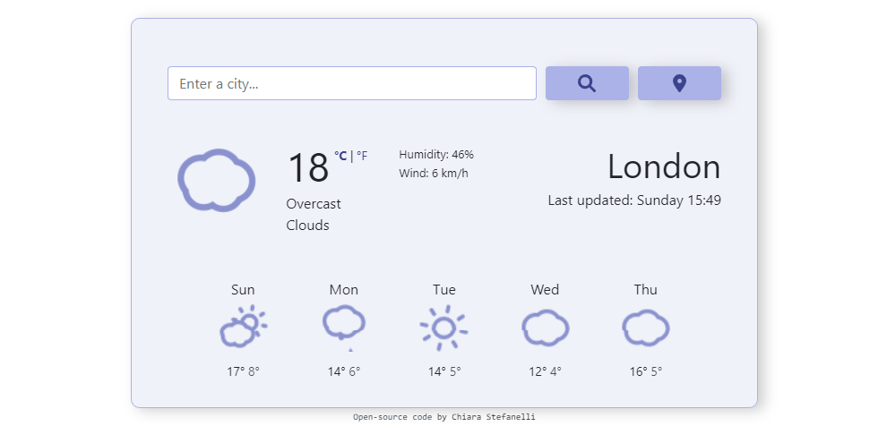
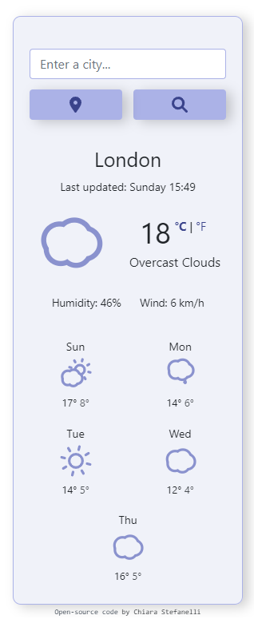

# Weather Forecast Website

This is one of the final projects from the [SheCodes React workshop](https://www.shecodes.io/react).

## Link

- [Project url](https://shecodesreact-weather-forecast.netlify.app/) (hosted on Netlify)

## Screenshots

 

## Project

Users should be able to:

- Check the current weather and the forecast of the city typed in the input field
- Check the current weather and the forecast of the user's current location
- View the current temperature in Celsius or Fahrenheit

## Built with

- HTML
- CSS
- Bootstrap
- JavaScript
- React
- Axios
- OpenWeatherMap API
- Font Awesome

## Author

Chiara Stefanelli - Front-End Development Student based in Italy

- Website - [Chiara Stefanelli](https://chiarastefanelli.netlify.app/)
- LinkedIn - [Chiara Stefanelli](https://www.linkedin.com/in/chiarastefanelli/?locale=en_US)
- start2impact profile - [Chiara Stefanelli](https://talent.start2impact.it/profile/chiara-stefanelli-13)
